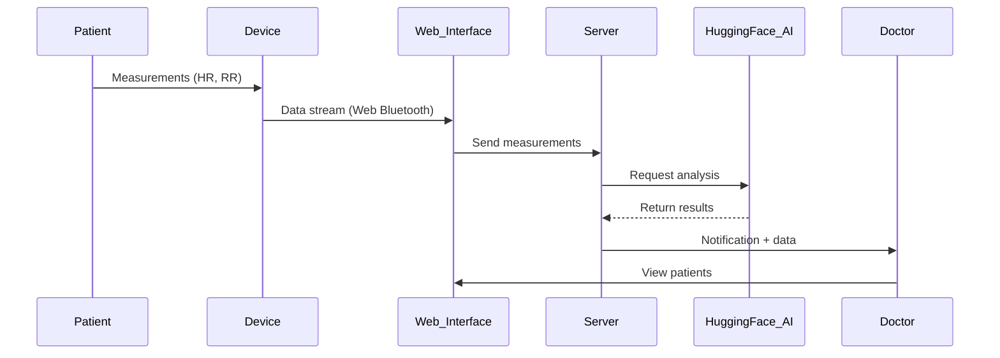

# heartShield v0.1
## 1. Introduction
### 1.1. Purpose of the Application
HeartShield is an intelligent application for remote monitoring of patients who have suffered a myocardial infarction. Its main goal is to reduce the risk of recurrent heart attacks by continuously tracking physiological parameters and alerting medical staff at early signs of deterioration, thereby also reducing the overall workload on healthcare professionals.

## 1.2. Target Audience
The application is intended for the following user groups:

- Cardiologists and other specialists supervising post-infarction patients.
- Patients who have completed treatment after a heart attack and are under observation.
- Medical institutions implementing digital solutions for outpatient monitoring and prevention.

## 1.3. Brief Functionality Overview
HeartShield enables:

- Integration with a wearable device (Movesense-10) and receiving real-time data via the server.
- Monitoring parameters related to the risk of a second heart attack (including heart rate variability – HRV).
- Using an external AI service to analyze data and predict dangerous conditions.
- Automatically notifying the doctor and patient when a potential threat is detected.
- Keeping a history of observations and providing the doctor with a convenient web interface to monitor multiple patients.

## 2. System Architecture
### 2.1. General System Overview
HeartShield is a web application for doctors, patients, and administrators, accessible via a browser. All users interact with a unified system built on a client-server architecture.

**The system includes:**
- A patient with a wearable device (Movesense-10) connected to the browser-based application.
- A doctor who accesses patient data and alerts through the interface.
- An administrator who manages users.
- A backend server implemented in Node.js, which handles data processing, authentication, and external AI module requests.
- AI analysis via remote calls to the DeepSick model hosted on the Hugging Face platform.
- A database (MySQL) storing users, measurements, and analytics.

**Component Interaction Diagram:**


### 2.2. Technologies Used
**Languages and Tools:**
- JavaScript (frontend + backend)
- HTML / CSS (layout)
- SQL (MySQL database)

**Frontend:**
- Vanilla JavaScript with Vite as the build tool
- Component-based structure without frameworks

**Backend:**
- Node.js + Express.js
- JWT for authorization
- bcryptjs for password hashing
- express-validator for form validation
- dotenv for environment variables
- External AI integration via OpenAI library (used for Hugging Face)

**Database:**

- MySQL with the mysql2 driver

**AI Module:**

- External DeepSick model (DeepSeek-R1) on Hugging Face
- API-based interaction, HR/RR analysis, and risk prediction return

### 2.3. System Components
**Web Application (browser interface):**

- Each role (patient, doctor, administrator) has a separate page. The interface follows a consistent visual style, while the functionality differs per role:
- Patient section: view and send measurements, receive alerts.
- Doctor section: monitor patient list, view history, receive risk alerts.
- Administrator section: manage users.

**Backend Server (Node.js + Express):**
- REST API: routes for authentication, data intake, and role-based interfaces.
- Data validation and checking.
- AI integration through external requests to Hugging Face (DeepSeek-R1).
- MySQL database interaction.

**Database (MySQL):**
- Tables: allusers, patients, doctors, admins, ai_results, alarms, metrics, patientrecomm, pat_data, pat_msg.

## 3. Functional Capabilities
### 3.1 Patient Interface
**Device connection:**

The patient uses an external wearable device (Movesense‑10). Data captured can be transmitted automatically.

**Status display:**

The main page shows real-time metrics such as heart rate, heart rate variability (HRV), and other available measurements. Visual indicators alert the patient to normal conditions or potential deviations.

**Notifications:**

Upon detection of a risk of health deterioration (based on AI analysis), the patient receives a system notification. It may include a brief recommendation or a prompt to contact the doctor.

**Sending data to the doctor:**

All measurements are automatically saved in the database and become accessible to the doctor via their monitoring interface. The patient cannot send data manually but can view their submission history.

### 3.2 Doctor Interface
**Viewing patient data:**

The doctor has access to a list of assigned patients, their latest measurements, and AI-generated reports.

**Risk notifications:**

The doctor is alerted when the AI detects abnormal changes in a patient’s metrics. Notifications are displayed in the system and may also be duplicated (e.g., via email).

**Medical history:**

A timeline of all the patient’s measurements, including AI assessments, is available for review.

**Patient registration and management:**

The doctor can add new patients, view their information, and examine their measurement history.

### 3.3 Analysis & Prediction
**Metrics used:**

The analysis considers:
- Heart rate (HR)
- Heart rate variability (HRV)
- RR intervals
- Recent patient metrics (SDNN, RMSSD, LF/HF, pNN50)

**AI‑module behavior:**

The AI module on Hugging Face (DeepSeek) processes the input data and estimates risk probability. Requests are made from the backend, and results are returned in text form (status, recommendation for the patient, note to the doctor).

**Critical‑change alerts:**

If threshold values are exceeded, the system issues immediate notifications to both the doctor and the patient.

## 4. Security and Privacy
### 4.1 Personal Data Processing
HeartShield processes personal and medical data of users, including:

- Name, surname, email address, phone number, date of birth, and ID
- User role (patient, doctor, administrator)
- Physiological metrics (heart rate, RR intervals)

All data is stored in a relational database on an Ubuntu (LTS) server hosted in Microsoft Azure Cloud. Currently:

- Data access is restricted based on user role
- All system actions require authorization
- Registration is possible only through an administrative process:
    - Administrators can create accounts for other admins and doctors
    - Doctors can create accounts for patients
    - Self-registration is not allowed

### 4.2 Data Encryption and Protection
- User passwords are stored in hashed form using bcrypt
- The server uses JWT to secure routes and verify user identity

### 4.3 Authentication and Authorization
- Users authenticate via email and password
- After successful login, the user receives a JWT token used to access protected routes
- The server includes an authenticateToken middleware to validate token authenticity
- Input data validation is implemented using express-validator

### 4.4 Data Storage and Access
- All data, including medical measurements, is stored in the same database on the same server as the backend
- Only assigned doctors can access their patients’ personal data. Patients can only view their own data. Administrators can only access registration data of all users
- All user actions take place through a web interface with role-based access control

### 4.5 External AI Integration
- Data is analyzed by sending requests to a model hosted on Hugging Face (DeepSeek-R1)
- Only anonymized physiological parameters are sent — no identifying information is shared
- The model's response is used to generate risk notifications and is stored in the server database

## 5. Devices and Compatibility
### 5.1 Supported Wearable Devices
At this stage, the heartShield app supports only one type of device — Movesense-10. It is a medical-grade sensor with Bluetooth Low Energy (BLE) support, capable of real-time transmission of physiological parameters such as:

- Heart rate
- RR intervals (used for HRV calculation)
- Other data (not used in the app)

The device connects directly through the browser using Web Bluetooth API (Low BLE), without the need to install any additional software.

### 5.2 Platform Compatibility
HeartShield is a web application that does not require installation. Currently, it is accessible via browsers that support Web Bluetooth:

- Chrome (recommended)
- Edge

Platform compatibility includes:

- Android — via Chrome with BLE support
- Windows 10/11 — via Chrome or Edge
- macOS — partial, depending on BLE support in the browser
- iOS — not supported, as Web Bluetooth API is not implemented in Safari on iOS (platform limitation)

## 6. Deployment and Configuration
### 6.1 Server Setup
The heartShield application consists of two components — frontend and backend — both implemented in JavaScript and run via Node.js. The server is deployed on a virtual machine running Ubuntu LTS, hosted on Microsoft Azure.

**Installation steps:**

Clone the project to the server:

```bash
git clone https://github.com/source-bob/HS.git
```

Install dependencies:

```bash
cd be/
npm install

cd ../fe/heartshield/
npm install
```

Run the server (in both directories separately):

```bash
npm run dev
```

❗️Port and server address are configured via .env files in the respective backend and frontend folders.

### 6.2 Initial Administrator Registration
The first administrator account must be created manually by inserting the data directly into the database.
The project includes a test script that creates:

- An administrator
- A doctor
- A patient

Example MySQL command to insert an administrator:

```sql
INSERT INTO allusers (user_id, user_email, user_password, user_type) VALUES
(1, 'jackbobson@example.com', '$2b$10$MXIpfGHiq20TO2/kJxX8deV5Pr2g0WjUbVbY.Ou9U.5U/QY2RMPWu', 'adm')
```
Password hashing is performed using bcryptjs.
After this, you can log in through the web interface and create new accounts via the admin panel.

### 6.3 Device Requirements
Currently, the application supports only the Movesense-10 wearable medical sensor, which transmits data via Bluetooth Low Energy (BLE). To connect, you need:

- A device with Bluetooth enabled
- A compatible browser (Chrome or Edge)
- Web Bluetooth API support on the user's platform

## 7. Limitations and Future Improvements
### 7.1 Current Limitations
The test version of the HeartShield application has several limitations due to both technical and administrative reasons:

**Sensor Support**

Currently, the application supports only the Movesense-10 sensor, which is used in the test version.

**AI Request Limit**

Data analysis using artificial intelligence is performed via the Hugging Face API. The free token allows only a limited number of requests (about 30), so the test version includes a 30-minute cooldown between AI queries. This solution is intended for demonstration purposes only.

**No Integration with Emergency Services**

Initially, integration with emergency services was planned. However, this requires special permissions and legal compliance. In the current version, alerts about critical conditions are only sent to the doctor, without automatically contacting emergency responders.

### 7.2 Planned Improvements (if development continues)
If the project continues, the following improvements are under consideration:

**Expansion of Supported Sensors**

In the future, support for other wearable devices for monitoring physiological parameters is planned (e.g., ECG patches, smart wristbands, or multi-channel sensors).

**Implementation of One or Two Local AI Modules**

The possibility of implementing two local AI models with different architectures or analytical methods is being considered. This would eliminate API limits and improve prediction reliability through cross-verification of results.

**Transition from REST API to WebSocket**

There are plans to replace or complement the current REST API with WebSocket-based communication. This would enable real-time, bidirectional communication between the client and server, improving the responsiveness of data transmission and notifications.

**Enhanced Data Security**

Planned enhancements include two-factor authentication, storage-level encryption, access control, and activity logging.

**Administrator Interface Expansion**

Adding tools for system monitoring, log management, and flexible control over user roles and permissions.

**Doctor Interface Enhancements**

Improved filtering, visualization tools, report generation, and patient-specific alert customization.

## 8. Contact Information and Support
### 8.1 Technical Support
At this stage, the HeartShield project is in its testing phase and was developed for educational purposes. If needed, you can contact the development team:

**📧 Email:**

heartshieldfi@gmail.com

**📦 Source code:**

https://github.com/source-bob/kokeilut4.git
https://github.com/source-bob/kokeilut4/tree/master

⏰ Support is provided within the scope of development.

### 8.2 Contact with Developers
The project was developed as part of the Vaatimusmäärittely course (Metropolia, Wellbeing and Health Technology) by students of group X:

**👤 Authors:**

- ChatGPT-4o — virtual engineering assistant, participated in all stages of development, assisted with architectural decisions, logic implementation, data analysis, and documentation preparation.

- a — developer, project executor.

**📍 Institution:**
Metropolia University of Applied Sciences

**🧭 Course:**
Vaatimusmäärittely — Wellbeing and Health Technology

Instructors: Matti P., Mikael S., Päivi H., Sakari L., Ulla S.

### 8.3 Sources and Scientific Basis
The development of the application was based on a preliminary literature review (taustakartoitus) and defined functional requirements (vaatimusmäärittely). Key ideas and conclusions:

**📚 Scientific and Technical Foundation:**

- Capabilities of wearable medical devices for ambulatory monitoring
- Use of heart rate variability (HRV) and RR intervals for early detection of disorders
- Limitations of PPG sensors compared to devices capable of directly measuring RR intervals
- Practical use of artificial intelligence in interpreting HRV and other physiological indicators

**💡 The analysis highlighted:**

- The relevance of developing remote monitoring systems after a heart attack
- The lack of comprehensive solutions focused on using RR intervals with connectable devices
- The concept of using two different AI modules to improve analysis accuracy and system resilience

## 9. Acknowledgments
The heartShield project was implemented as part of the Vaatimusmäärittely course under the academic supervision of the **lecturers** at **Metropolia University of Applied Sciences**.
We express our gratitude for the guidance, support, and educational foundation that made this implementation possible 🌱.