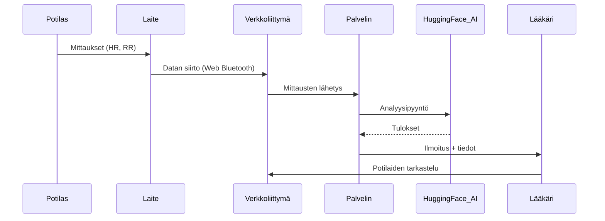

# heartShield v0.1
## sisältö
1. Johdanto
2. Järjestelmän Arkkitehtuuri
3. Toiminnalliset Ominaisuudet
4. Tietoturva ja Tietosuoja
5. Laitteet ja Yhteensopivuus
6. Käyttöönotto ja Määritykset
7. Rajoitukset ja Tulevat Kehityskohteet
8. Yhteystiedot ja tuki
9. Tekninen toteutus
10. Kiitokset

## 1. Johdanto
### 1.1. Sovelluksen tarkoitus
HeartShield on älykäs sovellus sydäninfarktin sairastaneiden potilaiden etäseurantaan. Sovelluksen päätavoitteena on vähentää toistuvan infarktin riskiä seuraamalla fysiologisia parametreja reaaliajassa ja varoittamalla hoitohenkilökuntaa varhaisista huononemisen merkeistä, mikä samalla keventää terveydenhuollon työkuormaa.

### 1.2. Kohderyhmä
Sovellus on suunnattu seuraaville käyttäjäryhmille:
- Kardiologit ja muut asiantuntijat, jotka seuraavat sydäninfarktista toipuvia potilaita.
- Potilaat, jotka ovat saaneet hoitoa infarktin jälkeen ja ovat seurantavaiheessa.
- Terveydenhuollon laitokset, jotka ottavat käyttöön digitaalisia ratkaisuja avohoidon seurantaan ja ennaltaehkäisyyn.

### 1.3. Toiminnallisuuden lyhyt kuvaus
HeartShield mahdollistaa:
- Integroinnin puettavaan laitteeseen (Movesense-10) ja reaaliaikaisen tiedon vastaanoton palvelimen kautta.
- Sydänkohtauksen uusiutumiseen liittyvien parametrien seurannan (mukaan lukien sykevaihtelu eli HRV).
- Ulkoisen tekoälypalvelun käytön tietojen analysointiin ja vaaratilanteiden ennustamiseen.
- Lääkärin ja potilaan automaattisen ilmoittamisen mahdollisesta uhasta.
- Tarkkailuhistorian tallennuksen ja verkkopohjaisen käyttöliittymän tarjoamisen lääkärille useiden potilaiden seurantaa varten.

## 2. Järjestelmän Arkkitehtuuri
### 2.1. Yleiskuva Järjestelmästä
HeartShield on verkkosovellus lääkäreille, potilaille ja ylläpitäjille, jota käytetään selaimen kautta. Kaikki käyttäjät toimivat yhdessä asiakas-palvelin-arkkitehtuuriin perustuvassa järjestelmässä.

**Järjestelmä sisältää:**

- Potilaan, jolla on Movesense-10 -puettava laite, joka on yhteydessä selainpohjaiseen sovellukseen.
- Lääkärin, joka tarkastelee potilastietoja ja hälytyksiä käyttöliittymästä.
- Ylläpitäjän, joka hallitsee käyttäjiä.
- Palvelinpuolen (Node.js), joka käsittelee tietoja, hoitaa todennuksen ja lähettää pyyntöjä ulkoiselle tekoälymoduulille.
- Tekoälyanalyysi, joka toimii etäyhteydellä DeepSick-malliin Hugging Face -alustalla.
- Tietokanta (MySQL), joka tallentaa käyttäjät, mittaukset ja analytiikan.

**Komponenttien vuorovaikutuskaavio:**


### 2.2. Käytetyt Teknologiat
**Kielet ja työkalut:**

- JavaScript (frontend + backend)
- HTML / CSS (asettelu)
- SQL (MySQL-tietokanta)

**Frontend:**

- Puhdas JavaScript, Vite kokoajana
- Komponenttipohjainen rakenne ilman kehyksiä

**Backend:**

- Node.js + Express.js
- JWT-valtuutus
- bcryptjs salasanojen hajautukseen
- express-validator lomakkeiden validointiin
- dotenv ympäristömuuttujille
- Ulkoinen tekoälyintegraatio OpenAI-kirjaston kautta (käytetään Hugging Faceen)

**Tietokanta:**

- MySQL mysql2-ajurilla

**Tekoälymoduuli:**

- Ulkoinen DeepSick-malli (DeepSeek-R1) Hugging Face -alustalla
- API-pohjainen yhteys, HR/RR-analyysi ja riskin palautus

### 2.3. Järjestelmän Komponentit
**Verkkosovellus (selainkäyttöliittymä):**

- Jokaisella roolilla (potilas, lääkäri, ylläpitäjä) on oma sivu. Käyttöliittymä on visuaalisesti yhtenäinen, mutta toiminnallisuus vaihtelee roolin mukaan:
- Potilaan osio: mittausten tarkastelu ja lähetys, ilmoitukset.
- Lääkärin osio: potilaslista, historiatiedot, riskihälytykset.
- Ylläpitäjän osio: käyttäjien hallinta.

**Palvelin (Node.js + Express):**

- REST API: reitit todennukselle, datan vastaanotolle ja roolikohtaisille rajapinnoille.
- Tietojen validointi ja tarkistus.
- Tekoälyintegraatio ulkoisten pyyntöjen kautta Hugging Faceen (DeepSeek).
- Yhteys MySQL-tietokantaan.

**Tietokanta (MySQL):**

- Taulut: allusers, patients, doctors, admins, ai_results, alarms, metrics, patientrecomm, pat_data, pat_msg.

## 3. Toiminnalliset Ominaisuudet
### 3.1 Potilaan Käyttöliittymä
**Laitteen yhdistäminen:**

Potilas käyttää ulkoista Movesense‑10-puhevaa laitetta. Kaikki mitatut tiedot lähetetään tarvittaessa automaattisesti.

**Tilan näyttö:**

Pääsivulla näytetään reaaliaikaiset mittarit, kuten syke, syketaajuuden vaihtelu (HRV) ja muut käytettävissä olevat mittaukset. Visuaaliset indikaattorit kertovat, ovatko arvot normaaleja tai poikkeavia.

**Ilmoitukset:**

Kun tekoäly havaitsee riskin tilan heikentymiselle, potilas saa järjestelmäilmoituksen. Ilmoituksessa voi olla lyhyt suositus tai kehotus ottaa yhteyttä lääkäriin.

**Tietojen lähettäminen lääkärille:**

Kaikki mittaukset tallentuvat automaattisesti tietokantaan ja ovat lääkärin nähtävillä valvontakäyttöliittymässä. Potilas ei lähetä tietoja manuaalisesti, mutta voi tarkastella lähetettyjen mittausten historiaa.

### 3.2 Lääkärin Käyttöliittymä
**Potilastietojen tarkastelu:**

Lääkärillä on pääsy liitettyjen potilaiden luetteloon, viimeisimpiin mittauksiin ja tekoälyn raportoimiin tuloksiin.

**Riskihälytykset:**

Jos tekoäly havaitsee potilaan mittauksissa poikkeamia, lääkäri saa hälytyksen. Hälytykset näkyvät järjestelmässä ja voidaan tarvittaessa lähettää myös muussa muodossa (esim. sähköposti).

**Tilahistoria:**

Potilaan mittausten aikajana ja tekoälyn arviot ovat lääkärin tarkasteltavissa.

**Potilaiden hallinta:**

Lääkäri voi lisätä uusia potilaita, tarkastella heidän tietojaan ja mittaushistoriaansa.

### 3.3 Analyysi ja Ennusteet
**Käytetyt mittarit:**

Analyysissä huomioidaan:

- Syke (HR)
- Syketajunnan vaihtelu (HRV)
- RR‑välit
- Potilaan viimeisimmät mittarit (SDNN, RMSSD, LF/HF, pNN50)

**Tekoälymoduulin toiminta:**

Hugging Facen DeepSeek‑malli analysoi sykekomennot ja arvioi riskiprosentin. Pyyntöjä lähetetään backendistä ja tulokset palautetaan tekstimuodossa (tila, suositus potilaalle, huomio lääkärille).

**Kriittisten muutosten hälytykset:**

Jos parametrit ylittävät kynnysarvot, järjestelmä lähettää välittömän ilmoituksen sekä lääkärille että potilaalle.

## 4. Tietoturva ja Tietosuoja
### 4.1 Henkilötietojen Käsittely
heartShield käsittelee käyttäjien henkilö- ja terveystietoja, kuten:

- Etu- ja sukunimi, sähköpostiosoite, puhelinnumero, syntymäaika, tunniste
- Käyttäjärooli (potilas, lääkäri, ylläpitäjä)
- Fysiologiset mittarit (syke, RR-välit)

Kaikki tiedot tallennetaan relaatio­tietokantaan Ubuntu (LTS) ‑palvelimella, joka sijaitsee Microsoft Azure ‑pilvessä. Tällä hetkellä:

- Tiedonsaanti on rajoitettu käyttäjäroolin mukaan
- Kaikki toiminnot vaativat kirjautumisen
- Rekisteröityminen on mahdollista vain hallinnollisesti:
    - Ylläpitäjät voivat luoda uusia ylläpitäjä- ja lääkärikäyttäjiä
    - Lääkärit voivat luoda potilastilejä
    - Itse­rekisteröinti ei ole käytössä

### 4.2 Salaus ja Suojaukset
- Käyttäjien salasanat tallennetaan hajautettuna (bcrypt)
- Palvelin käyttää JWT-tunnisteita suojaamaan reitit ja tunnistamaan käyttäjät

### 4.3 Tunnistus ja Käyttöoikeudet
- Käyttäjät kirjautuvat sähköpostilla ja salasanalla
- Onnistuneen kirjautumisen jälkeen käyttäjä saa JWT-tunnisteen, jolla pääsee suojattuihin reitteihin
- Palvelin sisältää authenticateToken-välimoduulin, joka tarkistaa tunnisteen voimassaolon
- Syötteiden validointi on toteutettu express-validator:lla

### 4.4 Tietojen Tallennus ja Käyttö
- Kaikki tiedot (mukaan lukien terveystiedot) säilytetään samassa tietokannassa ja samalla palvelimella kuin backend
- Vain potilaaseen liitetty lääkäri näkee hänen tietonsa. Potilas näkee vain omat tietonsa. Ylläpitäjä näkee vain kaikkien käyttäjien rekisteröintitiedot
- Kaikki käyttö tapahtuu verkkokäyttöliittymän kautta roolikohtaisilla oikeuksilla

### 4.5 Ulkoisen Tekoälyn Käyttö
- Tiedot analysoidaan lähettämällä pyyntö Hugging Face ‑palvelussa toimivaan malliin (DeepSeek-R1)
- Mallille lähetetään vain anonymisoidut fysiologiset tiedot — ilman tunnistetietoja
- Mallin vastausta käytetään riskihälytysten luomiseen, ja se tallennetaan palvelimen tietokantaan

## 5. Laitteet ja Yhteensopivuus
### 5.1 Tuetut Puettavat Laitteet
Tällä hetkellä heartShield-sovellus tukee vain yhtä laitetta — Movesense-10. Se on lääketieteellinen sensori, jossa on Bluetooth Low Energy (BLE) -tuki, ja se voi lähettää reaaliaikaisesti fysiologisia tietoja, kuten:

- Syke
- RR-välit (käytetään HRV-laskentaan)
- Muut tiedot (eivät käytössä sovelluksessa)

Yhteys muodostetaan suoraan selaimen kautta käyttäen Web Bluetooth API:ta (Low BLE), eikä erillistä ohjelmistoa tarvitse asentaa.

### 5.2 Alustojen Yhteensopivuus
HeartShield on selainpohjainen web-sovellus, jota ei tarvitse asentaa laitteelle. Tällä hetkellä se toimii selaimissa, jotka tukevat Web Bluetoothia:

- Chrome (suositeltu)
- Edge

Tuetut käyttöympäristöt:

- Android — Chromella ja BLE-tuella
- Windows 10/11 — Chromella tai Edgellä
- macOS — osittain, riippuen selaimen BLE-tuesta
- iOS — ei tuettu, koska Web Bluetooth API ei ole saatavilla Safarissa (alustarajoitus)

## 6. Käyttöönotto ja Määritykset
### 6.1 Palvelimen Asennus
HeartShield-sovellus koostuu kahdesta osasta — frontendistä ja backendistä — jotka molemmat on toteutettu JavaScriptillä ja käynnistetään Node.js:n kautta. Palvelin asennetaan Ubuntu LTS -virtuaalikoneelle, joka sijaitsee Microsoft Azuren pilvessä.

**Asennusvaiheet:**

Kloonaa projekti palvelimelle:

``` bash
git clone https://github.com/source-bob/HS.git
```
Asenna riippuvuudet:

```bash
cd be/
npm install

cd ../fe/heartshield/
npm install
```

Käynnistä palvelin (molemmissa hakemistoissa erikseen):

```bash
npm run dev
```

❗️Portti ja palvelimen osoite määritellään .env-tiedostoissa backend- ja frontend-kansioissa.

### 6.2 Ensimmäisen Ylläpitäjän Rekisteröinti
Ensimmäinen ylläpitäjä rekisteröidään manuaalisesti syöttämällä tiedot suoraan tietokantaan.
Projektissa on testiskripti, joka luo:

- Ylläpitäjän
- Lääkärin
- Potilaan

Esimerkki MySQL-komennosta ylläpitäjän lisäämiseksi:

```sql
INSERT INTO allusers (user_id, user_email, user_password, user_type) VALUES
(1, 'jack@example.com', '$2b$10$MXIpfGHiq20TO2/kJxX8deV5Pr2g0WjUbVbY.Ou9U.5U/QY2RMPWu', 'adm')
```
Salasanat hashataan bcryptjs-kirjaston avulla.
Tämän jälkeen voit kirjautua sisään verkkokäyttöliittymän kautta ja luoda uusia tilejä hallintapaneelissa.

### 6.3 Laitteistovaatimukset
Tällä hetkellä sovellus tukee vain Movesense-10 -laitetta, joka on lääkinnällinen puettava sensori ja siirtää tietoa Bluetooth Low Energy (BLE) -tekniikalla. Yhdistämistä varten tarvitaan:

- Laite, jossa on Bluetooth käytössä
- Yhteensopiva selain (Chrome tai Edge)
- Käyttöalustalta vaaditaan Web Bluetooth API -tuki

## 7. Rajoitukset ja Tulevat Kehityskohteet
### 7.1 Nykyiset Rajoitukset
HeartShieldin testiversiossa on useita rajoituksia, jotka johtuvat sekä teknisistä että hallinnollisista syistä:

**Anturien Tuki**

Tällä hetkellä sovellus tukee vain Movesense-10-anturia, jota käytetään testiversiossa.

**Rajoitettu määrä tekoälypyyntöjä**

Tietojen analysointi tapahtuu Hugging Face -alustan API:n kautta. Ilmaisen tunnuksen avulla voidaan tehdä vain rajallinen määrä pyyntöjä (noin 30), joten testiversiossa on käytössä 30 minuutin viive pyyntöjen välillä. Tämä ratkaisu on tarkoitettu vain demotarkoituksiin.

**Ei yhteyttä hätäkeskuksiin**

Alun perin suunniteltiin integrointia hätäpalveluihin, mutta tämä vaatii erityisiä lupia ja oikeudellista perustaa. Nykyisessä versiossa hälytykset kriittisistä tiloista lähetetään vain lääkärille, eikä automaattista avunpyyntöä ole.

### 7.2 Suunnitellut Parannukset (mikäli kehitys jatkuu)
Mikäli projektia jatketaan, harkitaan seuraavia kehityssuuntia:

**Anturivalikoiman laajentaminen**

Tulevaisuudessa on tarkoitus lisätä tuki muille kehon toimintaa mittaaville laitteille (esimerkiksi EKG-laastareille, älyrannekkeille tai monikanavaisille antureille).

**Yhden tai kahden paikallisen tekoälymoduulin käyttöönotto**

Suunnitteilla on toteuttaa kaksi erilaista paikallista tekoälymoduulia eri arkkitehtuureilla tai analyysimenetelmillä. Tämä poistaisi API-rajoitukset ja parantaisi ennusteiden tarkkuutta tulosten ristivertailun kautta.

**Siirtyminen REST API:sta WebSocketiin**

Suunnitteilla on korvata tai täydentää nykyinen REST API WebSocket-pohjaisella viestinnällä. Tämä mahdollistaisi reaaliaikaisen kaksisuuntaisen yhteyden asiakkaan ja palvelimen välillä, parantaen tiedonsiirron ja ilmoitusten nopeutta.

**Tietoturvan parantaminen**

Suunnitteilla on lisätä kaksivaiheinen tunnistautuminen, salaus tallennustasolla, lokien kirjaaminen ja käyttöoikeuksien hallinta.

**Ylläpitäjän käyttöliittymän laajentaminen**

Järjestelmän tilan seurantatyökalut, lokien hallinta sekä joustava käyttäjien ja oikeuksien hallinta.

**Lääkärin käyttöliittymän kehittäminen**

Parannettu suodatus, visualisointityökalut, raporttien luonti ja potilaskohtaisten hälytysten mukautusmahdollisuudet.

## 8. Yhteystiedot ja tuki
### 8.1 Tekninen tuki
Tällä hetkellä HeartShield-projekti on testausvaiheessa ja kehitetty opetustarkoituksessa. Tarvittaessa voit ottaa yhteyttä kehitystiimiin:

**📧 Sähköposti:**

heartshieldfi@gmail.com

**📦 Lähdekoodi:**

https://github.com/source-bob/HS.git
https://github.com/source-bob/HS/tree/v0.1#

⏰ Tuki tarjotaan osana kehitystyötä.

### 8.2 Yhteys kehittäjiin
Projekti on kehitetty osana Vaatimusmäärittely-kurssia (Metropolia, Hyvinvointi- ja terveysteknologia) ryhmän X opiskelijoiden toimesta:

**👤 Tekijät:**

- ChatGPT-4o — virtuaalinen insinööriassistentti, joka osallistui kaikkiin kehitysvaiheisiin, auttoi arkkitehtuuriratkaisuissa, logiikan toteutuksessa, tiedon analysoinnissa ja dokumentaation valmistelussa.

- a — kehittäjä, projektin toteuttaja.

**📍 Oppilaitos:**

Metropolia Ammattikorkeakoulu

**🧭 Kurssi:**

Hyte-2025

**Opettajat:** Matti P., Mikael S., Päivi H., Sakari L., Ulla S.

### 8.3 Lähteet ja tieteellinen perusta
Sovelluksen kehitys perustui kirjallisuuskatsaukseen (taustakartoitus) ja määriteltyihin toiminnallisiin vaatimuksiin (vaatimusmäärittely). Keskeiset ideat ja johtopäätökset:

**📚 Tieteellinen ja tekninen perusta:**

- Kannettavien lääkinnällisten laitteiden mahdollisuudet avohoitoseurantaan
- Sykevälivaihtelun (HRV) ja RR-intervallien käyttö häiriöiden varhaiseen tunnistamiseen
- PPG-antureiden rajoitteet verrattuna laitteisiin, jotka mittaavat RR-intervallin suoraan
- Tekoälyn käytännön hyödyntäminen HRV:n ja muiden fysiologisten mittareiden tulkinnassa

**💡 Analyysissa korostettiin:**

- Etäseurantajärjestelmien kehittämisen ajankohtaisuus sydäninfarktin jälkeen
- Kokonaisvaltaisten RR-intervallipohjaisten ratkaisujen puute liitettäville laitteille
- Kahden erilaisen tekoälymoduulin käyttökonsepti analyysin tarkkuuden ja vikasietoisuuden parantamiseksi

## 9. Tekninen toteutus
### 9.1 REST API
#### 🔐 Kirjautuminen ja rekisteröinti

**POST /api/login** – Käyttäjän kirjautuminen (sähköposti + salasana)
**POST /api/users** – Uuden käyttäjän luominen

#### 👤 Käyttäjät ja roolit
**GET /api/users** – Kaikkien käyttäjien lista (admin)
**GET /api/users/:id** – Potilaslista (lääkäri)
**DELETE /api/users/:id** – Käyttäjän poistaminen
**GET /api/admin/:id** – Yleiset tiedot käyttäjästä
**GET /api/info/:id** – Potilaan täydet tiedot (lääkäri)
**GET /api/:status/:id** – Rekisteröintitiedot käyttäjästä

#### 📊 Mittaukset ja analyysi
**POST /api/users/:id** – Potilaan lisätietojen tallennus
**GET /api/recom/:id** – Potilaan suosituslista
**POST /api/recom/:id** – Uuden suosituksen luonti
**GET /api/metrics/:id** – Potilaan mittaustiedot tietokannasta
**POST /api/metrics/:id** – Mittausten tallennus
**POST /api/emergency** – Uuden hälytyksen tallennus
**GET /api/emergency/:id** – Hälytysten tarkastus (lääkäri)
**POST /api/emergency/:id** – Potilaan hälytyksen luonti
**PATCH /api/emergency/:id** – Hälytyksen merkitseminen luetuksi
**GET /api/emergency/msg/:id** – Potilaan hälytysviestit
**PATCH /api/emergency/msg/:id** – Hälytyksen sulkeminen potilaan toimesta

#### 🤖 Yhteys tekoälyyn (sisäinen reitti)
**POST /api/ai** – Potilastietojen analysointi tekoälyllä
**GET /api/ai/:id** – Viimeisin vastaus tekoälyltä
**POST /api/ai/:id** – Vastauksen tallennus
**GET /api/ai/full/:id** – Kaikki tekoälyvastaukset

### 9.2 Datarakenne (esimerkki)

**Esimerkki mittausten lähettämisestä:**
```bash
{
    "sdnn": 131,
    "rmssd": 131,
    "pnn50": 31,
    "lfhf": 1.31,
    "rr_mean": 931,
    "hr": 91,
    "hrv": "Normaali"
}
```

**Esimerkki tekoälyn vastauksesta:**
```bash
{
    "status": "warning",
    "patient_instruction": "Jatka seurantaa ja ylläpidä normaalia aktiivisuutta. Ota yhteys lääkäriin, jos ilmenee rintakipua tai hengenahdistusta.",
    "doctor_note": "HRV-parametrit (SDNN, RMSSD, pNN50) ovat normaalilla tasolla. Tasapainoinen LF/HF-suhde viittaa vakaaseen autonomiseen toimintaan. Ei akuuttia sydänriskiä tämänhetkisten tietojen perusteella."
}
```

### 9.3 Database Structure
**SQL script for database creation:**  
[db-script.sql](be\db\db-script.sql)


### 9.4 Roolit ja käyttöoikeudet
**Potilas:** pääsy vain omiin tietoihin

**Lääkäri:** pääsy omien potilaiden laajennettuihin tietoihin

**Admin:** pääsy kaikkien käyttäjien rekisteritietoihin

Rekisteröityminen tapahtuu vain valtuutetun lääkärin (potilas) tai järjestelmänvalvojan (lääkärit ja adminit) kautta.

## 10. Kiitokset
HeartShield-projekti toteutettiin osana Hyte-2025-kurssia **Metropolian ammattikorkeakoulun** **opettajien** akateemisessa ohjauksessa.
Kiitämme ohjauksesta, tuesta ja opetusperustasta, jotka mahdollistivat projektin toteutuksen 🌱.