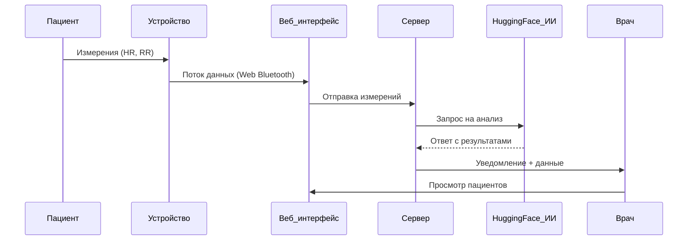

# **heartShield v0.1**
## **1. Введение**
### **1.1. Назначение приложения**
HeartShield — это интеллектуальное приложение для дистанционного мониторинга пациентов, перенесших инфаркт миокарда. Основная цель — снизить риск повторного инфаркта путём непрерывного отслеживания физиологических параметров и раннего оповещения медицинского персонала о признаках ухудшения состояния, что так же позволит снизить общую рабочую нагрузку на мед персонал.

### **1.2. Целевая аудитория**
Приложение предназначено для следующих групп пользователей:

- Врачи-кардиологи и другие специалисты, осуществляющие наблюдение за пациентами в постинфарктный период.
- Пациенты, прошедшие лечение после инфаркта и находящиеся под наблюдением.
- Медицинские учреждения, внедряющие цифровые решения для амбулаторного наблюдения и профилактики.

### **1.3. Краткое описание функционала**
HeartShield позволяет:

- Интегрироваться с носимым устройством (movesense-10) и получать данные в реальном времени через серверную часть.
- Отслеживать параметры, связанные с риском повторного инфаркта (в том числе вариабельность сердечного ритма (HRV)).
- Использовать внешний ИИ-сервис для анализа данных и прогнозирования опасных состояний.
- Автоматически уведомлять врача и пациента при обнаружении потенциальной угрозы.
- Вести историю наблюдений и предоставлять врачу удобный веб-интерфейс для мониторинга нескольких пациентов.

## **2. Архитектура системы**
### **2.1. Общая схема системы**
HeartShield — это веб-приложение для врачей, пациентов и администраторов, работающее через браузер. Все участники взаимодействуют с единой системой, построенной по клиент-серверной архитектуре.

**Система включает:**
- Пациента, у которого есть носимое устройство (Movesense-10), связанное с браузерным приложением.
- Врача, получающего доступ к данным пациента и предупреждениям через интерфейс.
- Администратора, управляющего пользователями.
- Серверную часть, реализованную на Node.js, которая обрабатывает данные, управляет аутентификацией, и отправляет запросы к внешнему ИИ-модулю.
- ИИ-анализ, реализованный через вызовы к удалённой модели DeepSick, размещённой на платформе Hugging Face.
- Базу данных (MySQL), хранящую пользователей, измерения и аналитику.

**Диаграмма взаимодействия компонентов:**

    
### **2.2 Используемые технологии**
**Языки и инструменты:**

- JavaScript (frontend + backend)
- HTML / CSS (вёрстка)
- SQL (MySQL база данных)

**Фронтенд:**
- Чистый JavaScript с использованием Vite как сборщика
- Компонентный подход без фреймворков

**Бекенд:**

- Node.js + Express.js
- JWT для авторизации
- bcryptjs для хеширования паролей
- express-validator для валидации форм
- dotenv для переменных окружения
- Вызовы к внешнему ИИ через библиотеку openai (используется для Hugging Face)

**База данных:**
- MySQL с драйвером mysql2

**ИИ-модуль:**
- Внешняя модель на Hugging Face (DeepSeek-R1)
- Взаимодействие по API, анализ HR/RR и возврат результата риска

### 2.3 Компоненты системы
**Веб-приложение (браузерный интерфейс):**

Каждая роль (пациент, врач, администратор) использует отдельную страницу. Интерфейс выполнен в едином визуальном стиле, но функциональность различается в зависимости от роли:

- Раздел пациента: просмотр и отправка измерений, получение уведомлений.
- Раздел врача: список наблюдаемых пациентов, просмотр истории, оповещения о рисках.
- Раздел администратора: управление пользователями.

**Бекенд-сервер (Node.js + Express):**

- REST API: маршруты для авторизации, приёма данных и взаимодействия с интерфейсами ролей.
- Валидация и проверка данных.
- Интеграция с ИИ через внешние запросы к Hugging Face (DeepSeek-R1).
- Работа с базой данных MySQL.

**База данных (MySQL):**

- Таблицы: allusers, patients, doctors, admins, ai_results, alarms, metrics, patientrecomm, pat_data, pat_msg.

## **3. Функциональные возможности**
### **3.1 Пациентский интерфейс**
**Подключение к устройству:**

Пациент использует внешнее носимое устройство (movesense-10). Полученные данные могут быть переданы автоматически.

**Отображение состояния:**

На главной странице отображаются актуальные показатели, такие как пульс, вариабельность сердечного ритма (HRV) и другие доступные метрики. Визуальные индикаторы сигнализируют о норме или возможном отклонении.

**Уведомления:**

При возникновении риска ухудшения состояния (по данным ИИ) пациент получает системное уведомление. Оно может содержать краткую рекомендацию или просьбу связаться с врачом.

**Отправка данных врачу:**
Все измерения автоматически сохраняются в базе и становятся доступны врачу в интерфейсе наблюдения. Пациент не управляет этим вручную, но может просматривать историю отправленных данных.

### 3.2 Врачебный интерфейс
**Просмотр данных пациентов:**
Врач имеет доступ к списку прикреплённых пациентов, их последним измерениям и отчётам ИИ.

**Уведомления о рисках:**
Врач получает оповещения, если ИИ фиксирует аномальные изменения в показателях пациента. Уведомления отображаются в системе и могут дублироваться.

**История состояния:**
Доступна временная шкала всех измерений пациента, включая оценки ИИ.

**Регистрация и управление пациентами:**
Врач может добавлять новых пациентов, просматривать их информацию и историю измарений.

### **3.3 Анализ и предсказание**
**Используемые метрики:**

В анализе учитываются:
- Частота сердечных сокращений (HR)
- Вариабельность сердечного ритма (HRV)
- RR-интервалы
- Последние метрики пациента (sdnn, rmssd, lf/hf, pnn50)

**Поведение ИИ-модуля:**

ИИ-модуль на Hugging Face (DeepSeek-R1) анализирует данные и оценивает вероятность риска. Запросы отправляются из бэкенда, результат возвращается в виде текстовой оценки(статус, рекомендация пациенту, сообщение для врача).

**Уведомления при критических изменениях:**

При превышении пороговых значений система инициирует немедленное уведомление как врачу, так и пациенту.

## **4. Безопасность и конфиденциальность**
### **4.1 Обработка персональных данных**
heartShield обрабатывает персональные и медицинские данные пользователей, включая:
- Имя, фамилию, адрес электронной почты, номер телефона, дату рождения, ид. 
- Тип пользователя (пациент, врач, администратор)
- Физиологические показатели (пульс, RR-intervaalit)

Все данные хранятся в реляционной базе данных на сервере Ubuntu (LTS) в облаке Microsoft Azure. На текущем этапе:
- Доступ к данным ограничен в соответствии с ролью пользователя.
- Все действия в системе требуют авторизации.
- Регистрация возможна только через административный процесс:
    - Администратор создаёт аккаунты других администраторов и врачей.
    - Врач создаёт аккаунты пациентов.
- Самостоятельная регистрация не предусмотрена.

### **4.2 Шифрование и защита данных**
- Пользовательские пароли хранятся в базе в хешированном виде с использованием bcrypt.
- Сервер использует JWT для защиты маршрутов и проверки подлинности пользователя.

### **4.3 Аутентификация и авторизация**
- Авторизация пользователей осуществляется через электронную почту и пароль.
- После успешной авторизации пользователь получает JWT-токен, который используется для доступа к защищённым маршрутам.
- На сервере реализована промежуточная функция authenticateToken, проверяющая действительность токена.
- В приложении реализована валидация входных данных с использованием express-validator.

### **4.4 Хранение и использование данных**
- Все данные (включая медицинские показания) хранятся в одной базе данных на том же сервере, где расположен backend-приложение.
- Доступ к личным данным пациентов имеют только прикреплённые к ним врачи. Пациенты видят только свои данные. Администратор имеет доступ только к регистрационной информации всех пользователей.
- Все пользовательские действия происходят через веб-интерфейс с учётом разграничения прав.

### **4.5 Работа с внешним ИИ**
- Анализ данных осуществляется через запросы к модели, размещённой на Hugging Face (DeepSeek-R1).
- В ИИ отправляются только обезличенные физиологические параметры — без идентифицирующей информации.
- Ответ от модели используется для генерации уведомлений о риске. Он так же сохраняется в серверной БД.

## **5. Устройства и совместимость**
### **5.1 Поддерживаемые носимые устройства**
На текущем этапе приложение heartShield поддерживает подключение только одного типа устройства — Movesense-10. Это медицинский датчик с поддержкой Bluetooth Low Energy (BLE), способный передавать в реальном времени физиологические параметры, такие как:
- Пульс
- Интервалы RR (используются для расчёта HRV)
- и другие (не используются в приложении)

Подключение осуществляется непосредственно через браузер с использованием технологии Web Bluetooth API (Low BLE), без необходимости установки дополнительного программного обеспечения.

### **5.2 Совместимость с платформами**
HeartShield представляет собой веб-приложение, не требующее установки на устройство. На данный момент поддерживается доступ через браузеры с поддержкой Web Bluetooth:
- Chrome (рекомендуется)
- Edge

Совместимость обеспечивается на следующих платформах:
- Android — через Chrome с поддержкой BLE
- Windows 10/11 — через Chrome или Edge
- macOS — частично, в зависимости от поддержки BLE в браузере
- iOS — не поддерживается, так как Web Bluetooth API не реализован в Safari на iOS (ограничение платформы)

## **6. Развёртывание и настройка**
### **6.1 Настройка сервера**
Приложение heartShield состоит из двух компонентов — фронтенда и бэкенда, оба реализованы с использованием JavaScript и запускаются через Node.js. Сервер развёртывается на виртуальной машине с Ubuntu LTS, размещённой на платформе Microsoft Azure.

**Этапы установки:**

1. Клонировать проект на сервер:

    ```bash
    git clone https://github.com/source-bob/HS.git
    ```

2. Установить зависимости:

    ```
    cd be/
    npm install

    cd ../fe/heartshield/
    npm install
    ```

3. Запустить сервер (в обоих каталогах по отдельности):

    ```
    npm run dev
    ```
❗️Порт и адрес сервера настраиваются в файлах .env в соответствующих папках backend и frontend.

## **6.2 Первичная регистрация администратора**
Регистрация первого администратора осуществляется вручную путём прямой вставки данных в базу данных. В проекте присутствует скрипт с тестовыми пользователями, который создаёт:
- Администратора
- Врача
- Пациента

Пример команды MySQL для добавления администратора:

```sql
INSERT INTO allusers (user_id, user_email, user_password, user_type) VALUES
(1, 'jack@example.com', '$2b$10$MXIpfGHiq20TO2/kJxX8deV5Pr2g0WjUbVbY.Ou9U.5U/QY2RMPWu', 'adm')
```

Хэширование паролей выполняется с использованием bcryptjs.
После этого можно авторизоваться через веб-интерфейс и создать дополнительные аккаунты через административную панель.

### **6.3 Требования к устройствам**
На текущем этапе приложение поддерживает только Movesense-10 — медицинский носимый сенсор с передачей данных по Bluetooth Low Energy (BLE). Для подключения необходимо:
- Устройство с включённым Bluetooth
- Совместимый браузер (Chrome или Edge)
- Поддержка Web Bluetooth API на платформе пользователя

## 7. Ограничения и будущие доработки
### 7.1 Текущие ограничения
Тестовая версия приложения HeartShield имеет ряд ограничений, обусловленных как техническими, так и административными факторами:

**Поддержка сенсоров**

На текущий момент приложение поддерживает только сенсор Movesense-10, используемый в тестовой версии.

**Ограничение на количество запросов к ИИ**

Анализ данных с использованием искусственного интеллекта осуществляется через API платформы Hugging Face. Бесплатный токен позволяет выполнить только ограниченное число запросов (около 30), поэтому в тестовой версии реализован временной кулдаун 30 минут между запросами. Это решение выбрано для демонстрационных целей.

**Отсутствие связи с экстренными службами**

Изначально планировалась интеграция с экстренными службами, однако для этого необходимы специальные разрешения и правовые основания. В текущей версии оповещения о критических состояниях направляются только врачу, без автоматического вызова помощи.

### 7.2 Запланированные улучшения (при продолжении разработки)
В случае продолжения проекта возможны следующие направления доработки:

**Расширение списка поддерживаемых сенсоров**

В будущем планируется добавить поддержку других носимых устройств для мониторинга физиологических показателей (например, ЭКГ-патчей, умных браслетов или многоканальных датчиков).

**Внедрение одного или двух локальных ИИ-модулей**

Рассматривается возможность внедрения двух локальных ИИ-модулей на разных архитектурах или с различными методами анализа. Это позволит не только снять ограничение по числу запросов, но и повысить точность и надёжность прогнозов за счёт перекрёстной верификации результатов.

**Переход с REST API на WebSocket**

Рассматривается возможность замены или дополнения текущего REST API на взаимодействие через WebSocket. Это позволит реализовать двустороннюю связь в реальном времени между клиентом и сервером, улучшив оперативность передачи данных и уведомлений.

**Улучшение защиты данных**

Реализация дополнительных мер безопасности, включая двухфакторную аутентификацию, шифрование на уровне хранения, ведение логов и контроль доступа.

**Расширение интерфейса администратора**

Добавление инструментов для мониторинга состояния системы, ведения логов, гибкого управления правами доступа и пользователями.

**Улучшение интерфейса врача**

Расширение возможностей фильтрации, визуализации, создания отчётов и настройки оповещений для каждого пациента индивидуально.

## 8. Контактная информация и поддержка
### 8.1 Техническая поддержка
На текущем этапе проект HeartShield находится в фазе тестирования и разработан в учебных целях. При необходимости можно связаться с командой разработчиков:

**📧 Электронная почта:**

heartshieldfi@gmail.com

**📦 Исходный код:**

https://github.com/source-bob/kokeilut4.git
https://github.com/source-bob/kokeilut4/tree/master

⏰ Поддержка осуществляется в рамках разработки.

### 8.2 Связь с разработчиками
Проект разработан в рамках курса Vaatimusmäärittely (Метрополия, Hyvinvointi- ja terveysteknologia) студентами группы X:

👤 Авторы:

- ChatGPT-4o — виртуальный инженерный ассистент, принимал участие во всех этапах проектирования, помогал с архитектурными решениями, реализацией логики, анализом информации и подготовкой документации

- a — разработчик, исполнитель проекта

**📍 Учебное заведение:**

Metropolia Ammattikorkeakoulu

**🧭 Курс:**
Vaatimusmäärittely — Hyvinvointi- ja terveysteknologia

Преподаватели: Matti P., Mikael S., Päivi H., Sakari L., Ulla S.

### 8.3 Использованные источники и научная основа
Разработка приложения базировалась на предварительном анализе литературы (taustakartoitus) и сформулированных функциональных требованиях (vaatimusmäärittely). Основные идеи и выводы:

**📚 Научная и техническая база:**

- Возможности носимых медицинских устройств для амбулаторного мониторинга
- Применение вариабельности сердечного ритма (HRV) и RR-интервалов в раннем выявлении нарушений
- Ограниченность PPG-сенсоров в сравнении с устройствами, способными измерять RR-интервалы напрямую
- Практика использования искусственного интеллекта в интерпретации HRV и других показателей

**💡 В рамках анализа подчёркнута:**

- Актуальность разработки систем удалённого мониторинга после инфаркта
- Отсутствие комплексных решений, ориентированных на использование RR-интервалов с подключаемыми устройствами
- Идея использования двух разных ИИ-модулей для повышения точности анализа и отказоустойчивости

## 9. Благодарности
Проект HeartShield был реализован в рамках курса Vaatimusmäärittely под академическим руководством **преподавателей Metropolia AMK**.
Выражаем благодарность за предоставленное направление, поддержку и учебную основу, которая сделала реализацию возможной 🌱. 